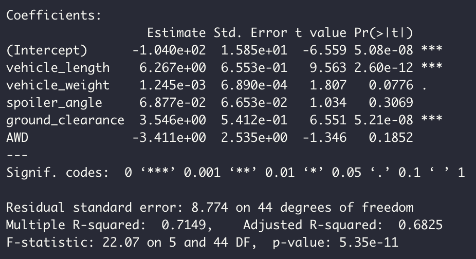
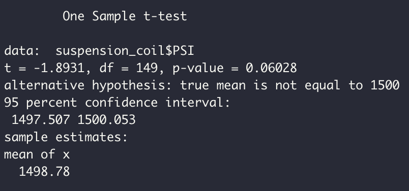
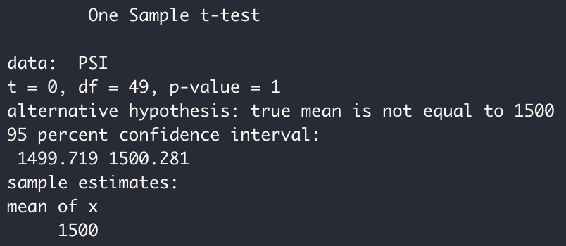
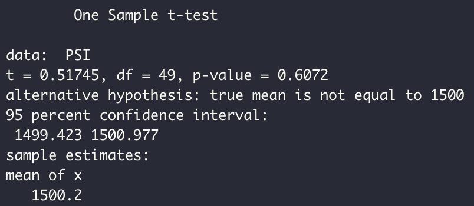
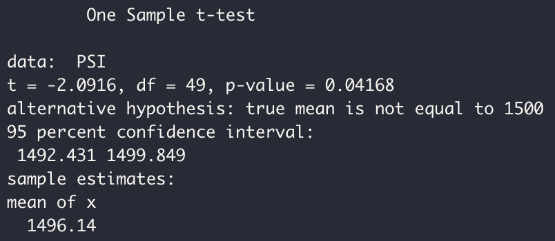

# Mecha Car Challenge

## Linear Regression to Predict MPG

* As shown in the image below, the coefficients that provided a non-random amount of variance to the mpg values in the dataset were "vehicle_length" and "ground_clearance", with a signficance level of 0.0001, and "vehicle weight", with a significance level of 0.1.
* The slope of the linear model is NOT considered to be zero, given that at least one of the independent variables, as shown in the image below, has an statistically significant coefficient.
* If one considers the "R-Squared" to be an adequate measure of prediction efficiency then, as it can be observed in the image below, the linear model predicts mpg of MechaCar prototypes with an efficiency of 0.7149.

## Summary Statistics on Suspension Coils

* As shown in the image below, the current manufacturing data DOES meet the design specification (the variance of the suspension coils must not exceed 100 pounds per square inch) for all manufacturing lots in total (variance of for all manufacturing lots in total: 62.29).

* As shown in the image below, the current manufacturing data DOES meet the design specification (the variance of the suspension coils must not exceed 100 pounds per square inch) in the case of "Lot1" and "Lot2" (variance for "lot1" and "lot2", respectively: 0.98 and 7.47), but DOES NOT meet the design specification in the case of "Lot3" (variance for "Lot3": 170.29).

## T-Tests on Suspension Coils

* As shown in the image below, for PSI of all manufacturing lots in total, with a significance level of 0.05 the null hypothesis that the sample mean is equal to the population mean (1,500) cannot be rejected.

* As shown in the image below, for PSI of "Lot1", with a significance level of 0.05 the null hypothesis that the sample mean is equal to the population mean (1,500) cannot be rejected.

* As shown in the image below, for PSI of "Lot2", with a significance level of 0.05 the null hypothesis that the sample mean is equal to the population mean (1,500) cannot be rejected.

* As shown in the image below, for PSI of "Lot3", with a significance level of 0.05 the null hypothesis that the sample mean is equal to the population mean (1,500) is rejected in favor of the alternative hypothesis that the sample mean is NOT equal to the population.

## Study Design: MechaCar vs Competition

* **Focus:** Fuel efficiency as measured by miles per gallon (MPG).
* **Metric to be Tested:** Miles per gallon (MPG).
* **Null and Alternative Hypotheses:** Null: The mean MPG of all competitors are equal; Alternative: At least the mean MPG of one competitor is different from all others.
* **Statistical Test:** The statistical test used to test the hypothesis would be the one-way ANOVA test as it allows to test the means of a single dependent variable (in this case MPG) across groups base on a categorical independent variable (in this case Competitor) simultaneously.
* **Data:** The data required for the test would include multiple observations from all relevant competitors, with "Competitor" shown as a categorical variable in the dataset and "MPG" as a normally distributed, numerical and continous variable in the dataset, as well. Also, we would require that the variance corresponding to the subset of the dataset for each competitor is similar among competitors to allow for the use of the one-way ANOVA test.

